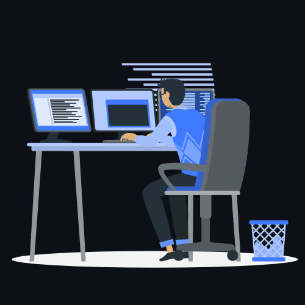

<h3 align="center">
    Hello world!&nbsp;
        
    &nbsp;Welcome to MIDLAJ C's profile!
    
</h3>

<!--   <em>
    I am a 3rd Year undergraduate from <b>Wmo Arts and Science College</b>, Wayanad, Kerala. 
  </em> -->
  

  
  &#8287;&#8287;&#8287;&#8287;&#8287;
  
  &#8287;&#8287;&#8287;&#8287;&#8287;
  
  &#8287;&#8287;&#8287;&#8287;&#8287;
  
  &#8287;&#8287;&#8287;&#8287;&#8287;
  
  &#8287;&#8287;&#8287;&#8287;&#8287;
  
  &#8287;&#8287;&#8287;&#8287;&#8287;
  
  &#8287;&#8287;&#8287;&#8287;&#8287;
  
  &#8287;&#8287;&#8287;&#8287;&#8287;
  
  &#8287;&#8287;&#8287;&#8287;&#8287;
    
  &#8287;&#8287;&#8287;&#8287;&#8287;
  

 

 
 

<h3 align="center">Languages</h3>

&nbsp;&nbsp;&nbsp;&nbsp;&nbsp;&nbsp;&nbsp;&nbsp;&nbsp;&nbsp;

<h3 align="center">Softwares</h3>

&nbsp;&nbsp;&nbsp;&nbsp;&nbsp;&nbsp;

<h3 align="center">Databases</h3>

&nbsp;&nbsp;

    

                                                                                           
<!-- 
 -->

 

<!--
**midlajc/midlajc** is a ✨ _special_ ✨ repository because its `README.md` (this file) appears on your GitHub profile.

Here are some ideas to get you started:

- 🔭 I’m currently working on ...
- 🌱 I’m currently learning ...
- 👯 I’m looking to collaborate on ...
- 🤔 I’m looking for help with ...
- 💬 Ask me about ...
- 📫 How to reach me: ...
- 😄 Pronouns: ...
- ⚡ Fun fact: ...
-->
